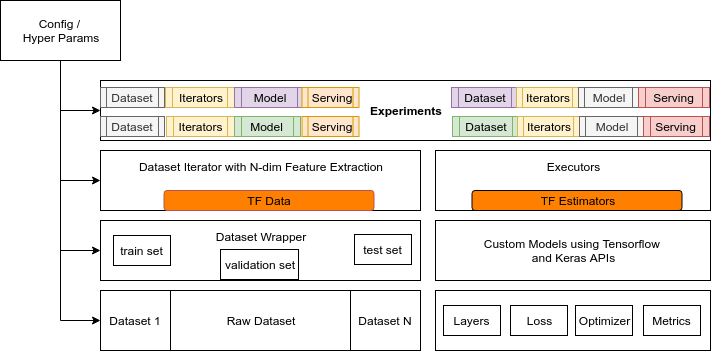

## Introduction

Deep Learning models proven its power in many application areas in recent times, however its entry into embedded world 
as its own twists and practical difficulties. 

## Problem Statement

Come up with a framework that enables fast prototyping of Deep Learning models for Audio (to start with!) and provide a 
easy way to port the models on to Android using TFLite.  
 
## Proposed Solution

Come up with following modular components which can be then used as plug and play components:
 - Dataset modules with preprocessing modules
 - DataIterator modules
 - Tensorflow Models (Estimators)
 - Engine to run the models
 - Tensorflow model serving using TFLite
    - Web app
    - Mobile



## [Dataset](data)
- [FreeSound from Kaggle](https://www.kaggle.com/c/freesound-audio-tagging)
- Speech Recognition
    - [Kaggle](https://www.kaggle.com/c/tensorflow-speech-recognition-challenge)
    - [Google](https://www.tensorflow.org/tutorials/sequences/audio_recognition)
    

-----------------------------------------------------------------------------------------------------------------------

## [Notebooks](notebooks)

-----------------------------------------------------------------------------------------------------------------------


## Python Environment

```
conda create -n shabda python=3.6 
source activate shabda
pip install -r requirements

```


# Other notatble Audio Repos
- https://github.com/mozilla/DeepSpeech
- https://towardsdatascience.com/how-to-use-dataset-in-tensorflow-c758ef9e4428
